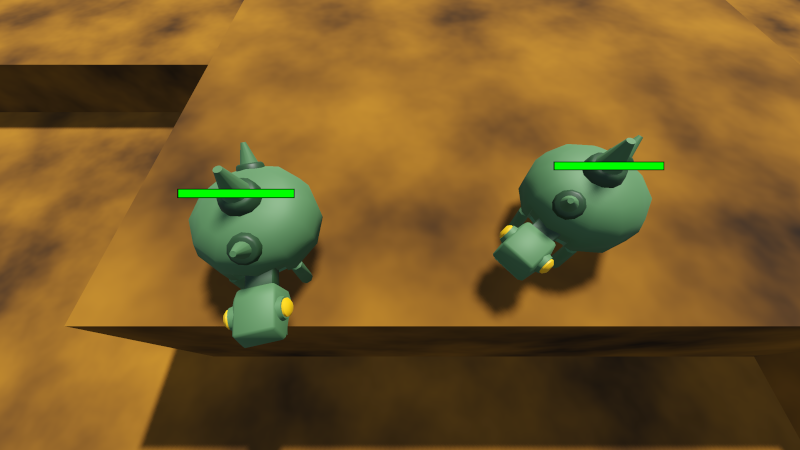

# ProgressBar3D for Godot 4
A simple 3d progress bar that uses a quad mesh plus a shader and employs no view ports. Great for use on 3D enemy characters as a health bar.

 

## Installation
The scripts are available on the Godot asset library, so it can be installed via the AssetLib feature in the Godot 4 editor.

Alternatively you can download/clone this repo and copy the addon folder to your Godot 4 project folder.

## Properties

### Size
Size of quad mesh used for progress bar.

### Value
Current value.

### Min Value
Minimum value.

### Max Value
Maximum value.

### Background Color
Background color.

### Progress Color
Fill color.

### Unshaded
Turns on, off shading of quad mesh.

### Shadows Disabled
Turns on, off shadows of quad mesh.

### Depth Test Disabled
Turns on, off depth test of quad mesh.

### Billboard Mode
Sets the quad mesh to face the camera (enabled), face camera but remain upright (fixed y) or disabled.

## Support
If you would like to support my development work to maintain this and other such projects you can do so at https://www.buymeacoffee.com/jlothamer.
 

